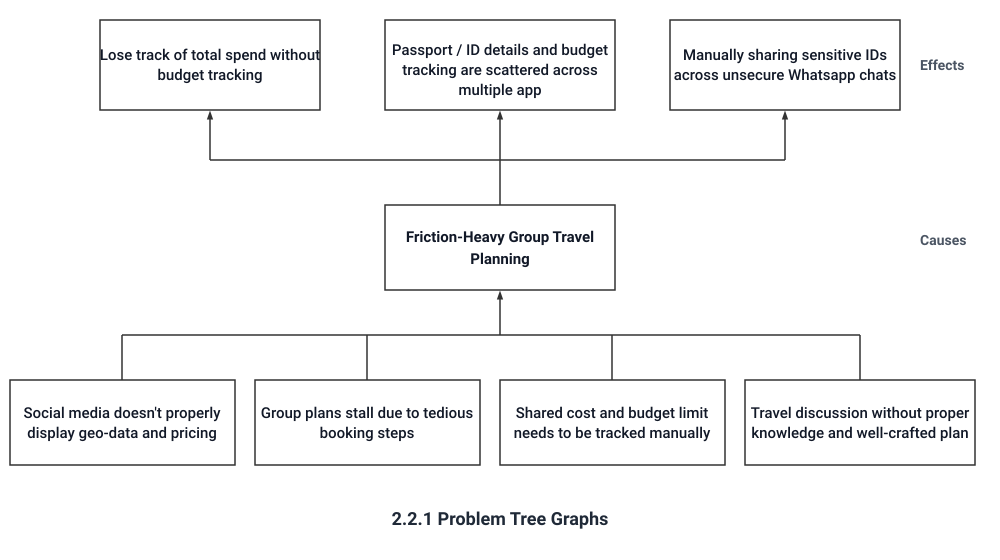
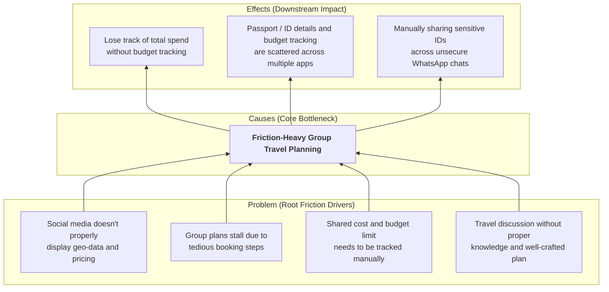
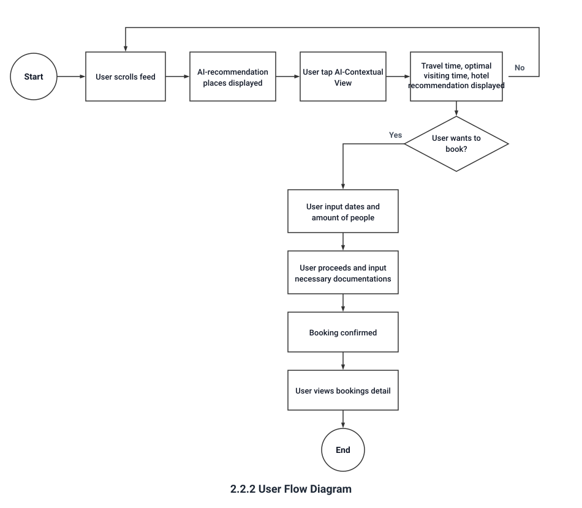
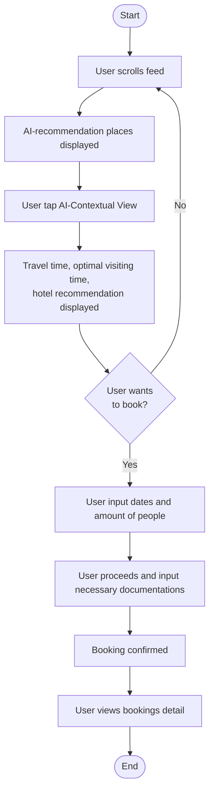
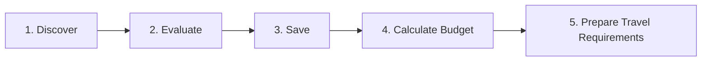
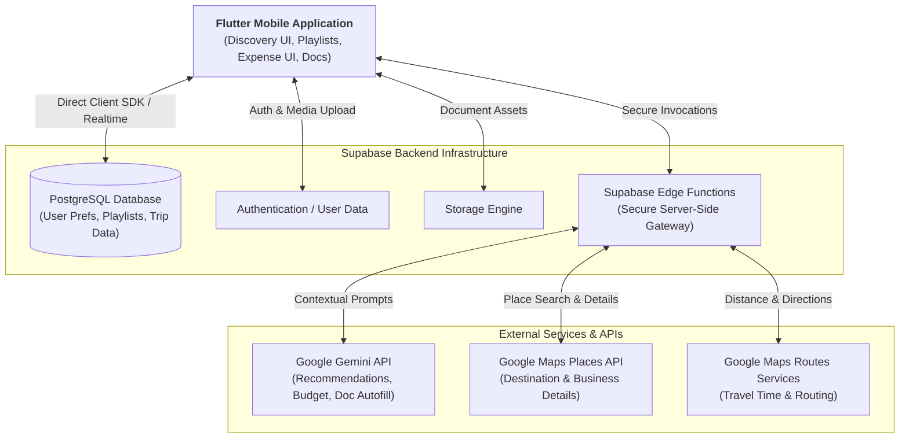

# Travel Planner Hub (CodeNection 2026 Preliminary Round Project)

A continuous, video-native group travel planning mobile application that bridges inspiration and execution by connecting vertical video discovery directly with contextual AI booking, group communication, and a secure document & expense ledger.

> 📊 **Presentation & App Design Slides**: [View on Canva (Travel Planner by Gamabunta)](https://canva.link/nc0i7mg6tdrd6wd)  
> Interactive presentation deck detailing the project explanation, problem breakdown, feature walkthroughs, and UI/UX app design examples.

---

## 2. Ideation & Process

### 2.1 Ideas We Considered

| Idea | Why it was dropped / kept |
| :--- | :--- |
| **Travel FYP Discovery Feed (Chosen)** | **Kept.** Replaces static search bars with engaging vertical video discovery, allowing users to scroll and explore travel destinations naturally. |
| **Contextual AI Booking Assistant (Chosen)** | **Kept.** Solves discovery friction by instantly extracting travel time, arrival estimates, and booking options directly from social videos. |
| **Unified Document & Expense Ledger (Chosen)** | **Kept.** Eliminates security risks and group fights by integrating secure passport verification and automated bill splitting into one workflow. |
| **Group Chat (Chosen)** | **Kept.** Keeps group discussions directly tied to specific video booking cards with multiple features added such as trip ledger and voting polls to avoid the feature act like a standard social media application. |
| **Budget Sync (Chosen)** | **Kept.** Features a live budget header in the lobby displaying target budget, total nights, and remaining money with AI synthesis recommendations. |
| **Community Hub (Chosen)** | **Kept.** For user to discover and communicate with travelling community and gather knowledge and guidance. |
| **AI Ideation (Chosen)** | **Kept.** User can alter the algorithm to find travel place catered more to their likings. |

### 2.2 Ideation Boards

#### 2.2.1 Problem Tree Graphs
This tree breaks down the core causes of travel planning friction—such as unstructured social media content and fragmented communication—and traces their downstream impacts on trip abandonment and budget overruns.

<p align="center">
  
</p>

<details open>
<summary><b>Mermaid Diagram View</b></summary>



</details>

#### 2.2.2 User Flow Diagram
This diagram maps the user's journey from vertical video discovery in the FYP lobby through AI contextual booking, secure document verification, and group management.

<p align="center">
  
</p>

<details open>
<summary><b>Mermaid Flowchart View</b></summary>



</details>

### 2.3 Mentor Consultation

| Date | Mentor | Feedback Received | What Was Changed |
| :--- | :--- | :--- | :--- |
| **8/9/2026** | **Faris Imran** | <ul><li>Make the app become more social friendly.</li><li>Nail down the scalability of the app.</li><li>Make sure the main focus of the app still align with the problem statement.</li></ul> | <ul><li>Multiple features added in group chats to aid user plan travels rather than just acts as a way for communication like voting system and split payment.</li><li>A community system was created as a way for people to create a travel plan together with an unfamiliar faces for the sake of travelling benefits.</li></ul> |

---

## 3. Creativity and Novelty

### 3.1 Originality
Individually, short-form video discovery, AI content parsing, and expense-splitting tools all exist. No mainstream product combines them into one continuous group-travel flow. Our app treats the FYP-style feed itself as the entry point to booking, rather than treating inspiration (TikTok/Instagram), search/booking (Skyscanner, Agoda), communication (WhatsApp), and expense tracking (spreadsheets or splitting apps) as four separate steps in four separate apps. The originality is in this synthesis: an agentic AI layer sits between passive video content and an actionable, bookable, financially-coordinated group plan, which is a genuinely new combination of existing ideas rather than an incremental feature added to an existing travel app.

### 3.2 Novel Features or Twists
The standout twist is the Contextual AI Booking Assistant: it extracts travel time, arrival estimates, hotel recommendations, and booking options directly from the unstructured video a user is already watching, so scrolling itself becomes the search step. This is reinforced by several other clever features working together:
- **Booking-card-anchored group chat**: Keeps discussion directly attached to the specific trip option being decided on, instead of scattered across a generic WhatsApp thread.
- **Unified document and expense ledger**: Replaces manually sharing passport photos over chat with secure, in-app document verification.
- **Live budget header in the lobby**: Displays target budget, total nights, and remaining money, with AI-generated spend recommendations rather than static totals.

Together these form a standout twist that defines the product: it is the first video-native app where watching, deciding, booking, verifying, and paying happen without leaving the feed.

### 3.3 Differentiation from Existing Solutions
TikTok and Instagram surface travel inspiration but stop there — the user must manually leave the app to search, price, and book. Skyscanner, Agoda, and Booking.com handle search and booking but assume the user already knows what they want and offer no discovery or group-coordination layer. WhatsApp plus a manual spreadsheet is the default group-planning stack today, but it is fragmented and insecure — passport and ID photos are routinely shared over unencrypted chat threads with no verification layer, and spend tracking depends on someone remembering to update a shared sheet. TripIt and similar itinerary organizers only take over after a booking is already made. Our app is different because it is the only one that spans the full chain — discovery, contextual booking, secure verification, and group finance — in a single continuous flow, removing both the "app-switching tax" of juggling four or five tools and the specific security exposure of sharing identity documents over consumer chat apps.

---

## 4. Impact

### 4.1 Understanding the Problem Context
Group travel planning is friction-heavy for identifiable, structural reasons rather than a single vague pain point. Social media, the channel where most trip inspiration now happens, does not surface geo-data or pricing, so inspiration and execution are disconnected. Group booking stalls because it requires tedious, repeated manual steps across members. Shared costs and budget limits have to be tracked manually with no dedicated tool. Travel discussions happen without a structured plan behind them. Left unaddressed, these causes produce real downstream harm: groups lose track of total spend, passport and ID details end up scattered across multiple apps or shared over unsecured WhatsApp chats (a genuine identity-fraud exposure, not just an inconvenience), and trips are abandoned or run over budget as a result. This is the specific chain our mentor consultation pushed us to sharpen — confirming the solution stays anchored to this problem statement rather than drifting into a generic travel app.

### 4.2 Target Group Alignment
The target group is not "everyone who travels" — it is groups of friends and young travelers who already discover destinations through short-form video feeds and plan trips collectively rather than through a travel agent or a single organizer. This group spends significant time on FYP-style feeds for inspiration but today has no direct path from "I saw this in a video" to "we booked it together, split the cost, and verified our documents." Every core feature speaks to a real behavior this group already has: scrolling for inspiration, coordinating in group chats, and splitting shared costs — rather than asking them to adopt an unfamiliar workflow.

### 4.3 Effectiveness of the Solution
- **Before**: A user watches a travel video, screenshots or notes it, leaves the app to search a separate booking engine, manually retypes the details into a group chat, individually shares passport scans over that same unsecured chat so members can book or apply for visas, and tracks who owes what by memory or a separate spreadsheet — a slow, five-to-six step process spread across four or five different apps, with a real security exposure along the way.
- **After**: The user watches the same video, taps the AI-contextual view, and instantly sees travel time, arrival estimates, and hotel recommendations; the group chat is already attached to that specific booking card; every member submits verification documents once through a secure ledger instead of over chat; and the live budget header updates automatically with remaining group funds and AI spend recommendations. Each step in the "before" chain maps directly onto a feature that removes it, so the improvement is not incremental convenience — it collapses a fragmented, insecure, multi-app process into one continuous, safer in-app flow.

### 4.4 Reach and Scalability
The initial cohort is group and student travelers, but the architecture scales in more than one direction. Mentor feedback specifically pushed us to nail down scalability, which led directly to adding a community layer where users can form travel plans with people outside their existing friend group — turning the product from a tool for trips already being planned into one that can generate new group trips on its own. The same AI-parsing layer that reads existing short-form travel video also means growth is a content and partnership problem, not a re-architecture problem: it extends naturally to solo travelers and families by adjusting the chat and ledger features, and to new regions and languages as creator content from those markets is already being produced elsewhere. Longer term, booking commissions and creator/affiliate partnerships give the discovery layer itself a monetizable, scalable growth path.

---

## 5. Feasibility

### 5.1 Technical Viability and Technology Stack

The proposed solution is technically feasible within the hackathon environment because it uses established technologies, managed cloud services, and existing APIs rather than requiring the team to develop complex infrastructure or AI models from scratch.

The current application is a UI prototype/mock-up that demonstrates the intended user experience and overall travel-planning workflow. During the hackathon build phase, the team will connect this existing interface to the backend, database, AI services, and external APIs to transform the prototype into a functional system.

#### Proposed Technology Stack

| Component | Technology / Service | Why It Is Chosen | Expected Constraint |
| :--- | :--- | :--- | :--- |
| **Frontend** | **Flutter** | Provides a single codebase for rapid development of the mobile application and is suitable for the existing TikTok-style discovery interface. | Limited time for advanced animations and UI polishing. |
| **Backend & Database** | **Supabase** | Provides PostgreSQL database services together with authentication, storage, real-time capabilities, and Edge Functions in one platform. Direct Flutter support reduces integration effort. | Free/limited resources and API usage may become a constraint as usage increases. |
| **AI Service** | **Google Gemini API** | Used for travel recommendations, budget estimation, contextual reasoning, and document-assistance workflows without training a new model from scratch. | API rate limits, response latency, and variability of AI-generated outputs. |
| **Location / Business Data** | **Google Maps Platform – Places API** | Provides place search and place details that can support destination and business recommendations, including current place information where available. | API quotas, billing requirements, and incomplete data coverage for some locations. |
| **Travel / Routing Data** | **Google Maps Platform – Routes / Location Services** | Used to support travel-time and route-related information required by the planning workflow. | External API availability, quota, and response latency. |
| **Server-side Integration** | **Supabase Edge Functions** | Acts as the secure server-side layer for AI and external API requests so sensitive service credentials are not directly exposed in the Flutter application. | Additional implementation effort for server-side functions and API error handling. |
| **Hosting / Deployment** | **Supabase Cloud & Flutter Android APK** | Minimizes infrastructure and deployment complexity while allowing the team to demonstrate the application directly on an Android device/emulator. | Cloud service limits and dependency on internet connectivity during demonstrations. |

- **Flutter** supports multi-platform application development from a single codebase, making it appropriate for rapid hackathon development.
- **Supabase** provides a managed PostgreSQL database together with authentication, storage, realtime capabilities, and Edge Functions, while its official Flutter library allows the application to communicate directly with Supabase services.
- The **Gemini API** provides content-generation capabilities that can be integrated into the application for recommendation and reasoning tasks rather than requiring the team to train its own AI model.
- **Google Places API** provides place search, place details, and related location information that can support the application's destination and business discovery functions.

```
Flutter Frontend ──► Supabase Backend ──► Supabase Edge Functions ──► Gemini API / Google Maps APIs
```

The database component will store user preferences, saved destinations, playlists, and other trip-related information. Edge Functions provide the server-side layer for processing requests and communicating with external services.

> [!IMPORTANT]
> **API Key Security & Integrity**: External API credentials should not be unnecessarily exposed inside the mobile application. Server-side Edge Functions act as the controlled integration point for services such as Gemini and Google Maps, adhering to Supabase's recommended security best practices of protecting production credentials rather than committing sensitive keys into application client code.

---

### 5.2 Planning and Scope Realism

We have intentionally separated the overall product vision from the hackathon implementation scope. The current application is a mock-up/prototype that demonstrates the intended interface and user journey. The build phase will focus on implementing the underlying functionality behind the existing interface instead of rebuilding the entire application from the beginning.

#### Version 1.0 Core Modules
The project's Version 1.0 scope is focused on four core modules:
1. **Discovery Feed**: Destination discovery, contextual recommendations, estimated travel or arrival information, and suggested visiting periods.
2. **Expense Engine**: AI-assisted travel budget and destination expense estimation.
3. **Custom Playlists**: Saving and organizing destinations users are interested in visiting.
4. **Document Automation**: AI-assisted completion of mandatory travel information and forms.

#### Hackathon Implementation Scope


The broader product concept includes group planning, social interaction, budgeting, and community functionality. These remain part of the long-term product vision, but they are not dependencies for completing the core hackathon prototype. We are not attempting to reproduce every function of a commercial travel platform within the available build period; instead, the team will demonstrate a focused end-to-end workflow using the most critical features.

Mentor consultation further reinforced this direction—emphasizing social usefulness, scalability, and continued alignment with the problem statement, which led to additional group-oriented and community concepts for the long-term roadmap.

---

### 5.3 Resource and Time Awareness

The project is designed around resources that are practical for a small hackathon team. Because the UI prototype has already been prepared, we do not need to spend the entire build phase creating the frontend from scratch. Development effort can instead be concentrated on backend integration, AI functionality, external APIs, database connectivity, and testing.

#### 6-Phase Build Plan

| Phase | Milestone | Key Deliverables |
| :--- | :--- | :--- |
| **Phase 1** | **Backend & Data Foundation** | <ul><li>Configure Supabase project</li><li>Create database tables and relationships</li><li>Connect Flutter to Supabase</li><li>Define required user and destination data structures</li></ul> |
| **Phase 2** | **AI Integration** | <ul><li>Integrate Gemini API through Supabase Edge Functions</li><li>Implement travel recommendation logic</li><li>Implement budget estimation</li><li>Test and validate AI responses</li></ul> |
| **Phase 3** | **External Data Integration** | <ul><li>Integrate Google Places and location services</li><li>Retrieve destination/business information</li><li>Implement business-status checks where applicable</li><li>Handle API failures and unavailable data</li></ul> |
| **Phase 4** | **Document Automation** | <ul><li>Implement AI-assisted travel form/document autofill</li><li>Connect the functionality to the existing prototype interface</li></ul> |
| **Phase 5** | **End-to-End Integration** | <ul><li>Replace placeholder/mock data with functional data</li><li>Connect the four core modules</li><li>Verify that information flows correctly between frontend, backend, and external services</li></ul> |
| **Phase 6** | **Testing & Demonstration** | <ul><li>Test the primary user journey</li><li>Handle AI/API failure cases</li><li>Fix high-priority bugs</li><li>Prepare the final demonstration</li></ul> |

#### Risk Management & Technical Constraints
Known technical constraints—including API rate limits, external-service availability, AI response latency, and limited hackathon development time—are mitigated by prioritizing the core workflow and keeping non-essential features outside the critical path.

**Minimum Demonstrable Journey:**


---

### 5.4 System Architecture

The proposed system architecture establishes a decoupled, secure data flow between the client application, backend services, and external APIs:



#### Architectural Highlights & Feasibility Summary
- **Decoupled Security**: The frontend communicates with Supabase, while external AI and service APIs are accessed through the Edge Function server-side layer, safeguarding API secrets.
- **Cross-Platform Velocity**: Uses an established cross-platform framework (Flutter), a managed backend/database platform (Supabase), existing AI services (Gemini API), and external location APIs (Google Maps Platform). This eliminates the burden of building complex custom infrastructure or training models from scratch.
- **Controlled Scope**: The hackathon implementation focuses on four core modules and one primary end-to-end workflow. Advanced community, social, and group-planning functions remain part of the broader product vision without blocking the core prototype demonstration.

Therefore, the project provides a realistic, dependable path from the current mock-up to a fully functional prototype while maintaining rich technical depth.

---

## Getting Started

This project is built using Flutter.

### Prerequisites
- Flutter SDK (3.x or later)
- Dart SDK
- Android Studio / Xcode / VS Code with Flutter extension

### Running the App
```bash
flutter pub get
flutter run
```
